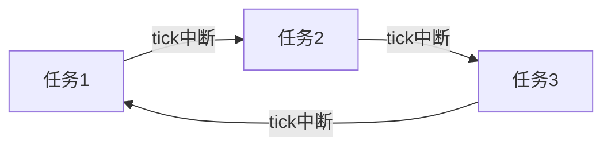
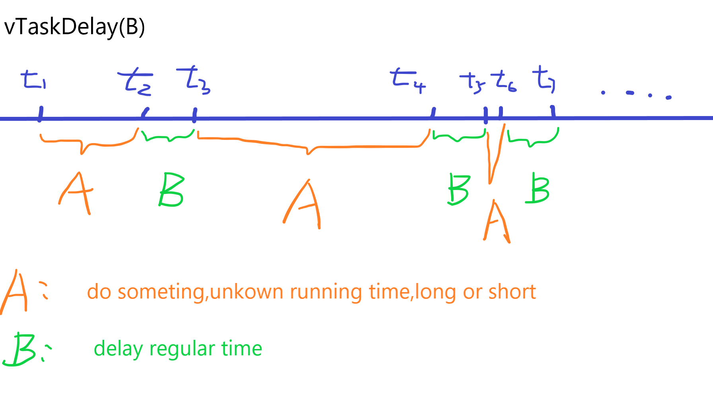
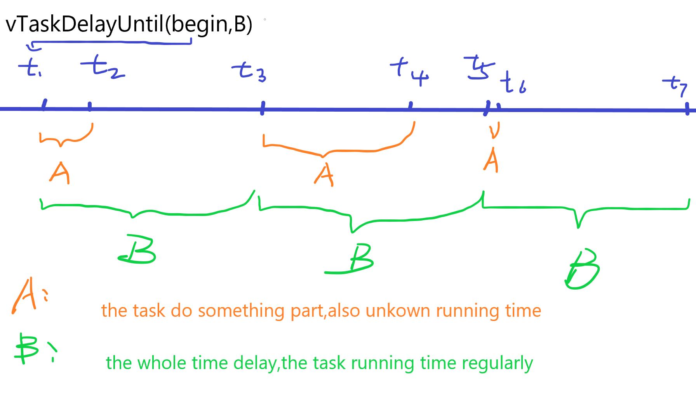
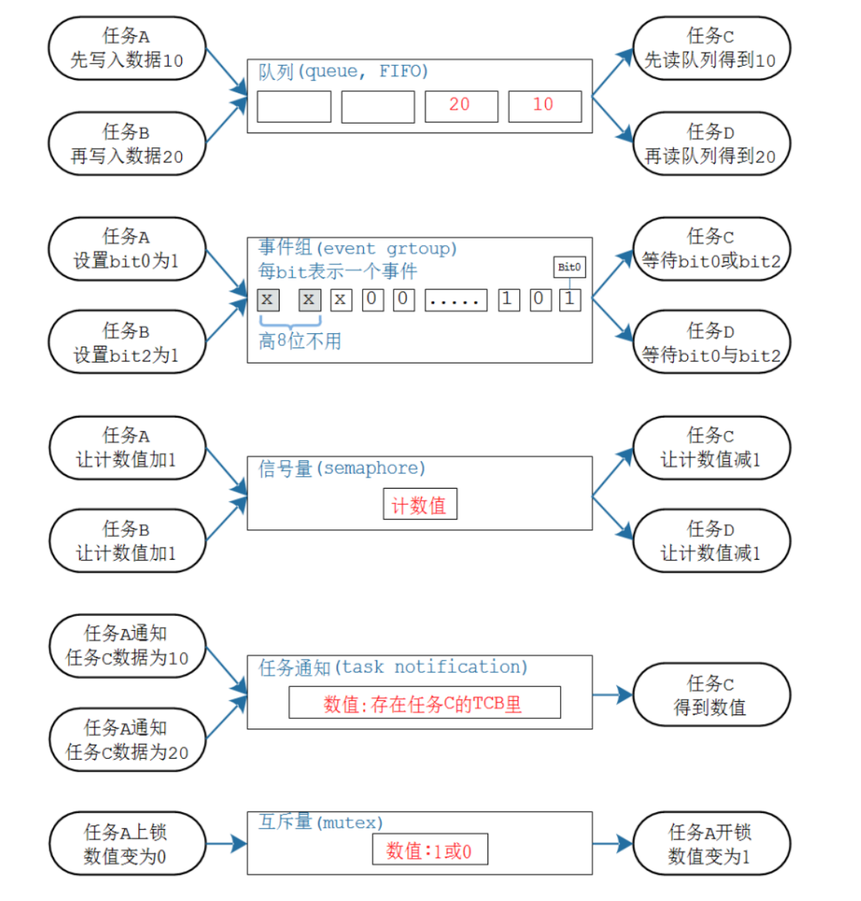
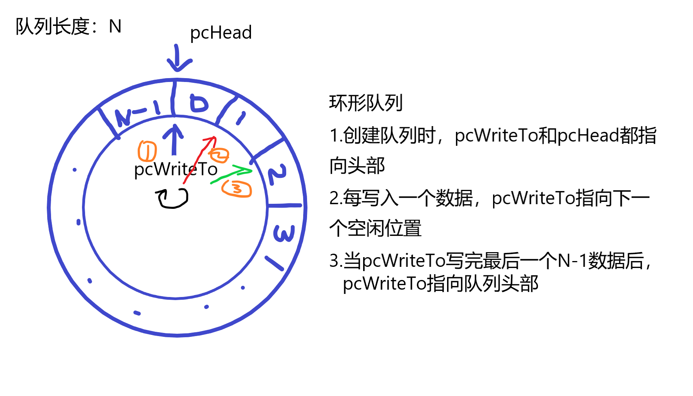
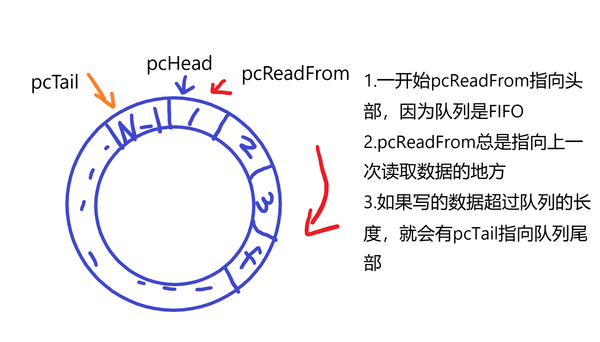
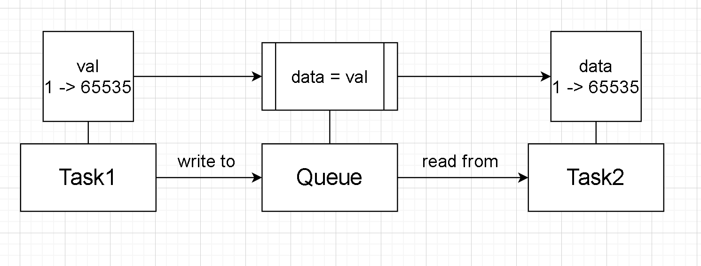
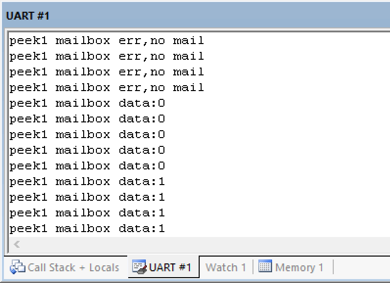

### 一、堆和栈

##### 1. 堆(heap)

堆由开发人员手动申请分配和释放空间，若不手动释放，程序结束由系统释放，但在单片机都会有while(1)死循环，程序无法结束，因此要牢记申请空间用完后释放。

##### 2. 栈(stack)

栈由系统自动分配和释放内存，存放函数的返回地址，局部变量等

---

### 二、从目录文件了解源码结构

从[FreeRTOS](https://www.freertos.org/)官网下载的文件解压缩之后，得到三个目录文件

##### FreeRTOS

RTOS的核心，打开之后得到以下文件夹

+ Demo：官方Demo，打开之后
  + 各种处理器rtos的demo
  + 一个common通用文件夹

+ License：应该是开源凭证
+ Source：FreeRTOS的核心源代码
+ Test：一些测试

##### FreeRTOS-Plus

官方描述是FreeRTOS和一些组件的结合

[FreeRTOS-Plus](http://www.freertos.org/plus)

##### tools

暂时不懂，以后补充

---

整体目录结构图：


---

### 三、创建任务

##### 动态创建

###### 函数

```C
//动态创建任务函数
BaseType_t xTaskCreate( TaskFunction_t pxTaskCode,
                            const char * const pcName, 
                            const configSTACK_DEPTH_TYPE usStackDepth,
                            void * const pvParameters,
                            UBaseType_t uxPriority,
                            TaskHandle_t * const pxCreatedTask )
```

###### 参数解析

```C
TaskFunction_t pxTaskCode//任务执行的函数，直接写函数名字
const char * const pcName//任务的名字
const configSTACK_DEPTH_TYPE usStackDepth//栈的大小，深度
/*
	每个实时任务都是通过栈实现的，每个任务都有自己的栈
	这里的单位是字长(word)，等于4个字节
*/
void * const pvParameters//需要传入函数的参数
UBaseType_t uxPriority//任务优先级，数值越小优先级越低
TaskHandle_t * const pxCreatedTask//任务句柄
/*
	可以简单理解为一个媒介，通过这个媒介可以控制任务
	可以是NULL，也可以通过TaskHandle_t创建句柄并传入
	有句柄时其他任务就可以通过句柄控制对应的任务
*/
```
###### 举例

```C
//仅展示关键代码
void TaskFun1(void* arg)
{
	while(1)
	{
		printf("1");
	}
}

xTaskCreate(TaskFun1,"Task1",100,NULL,1,NULL);//无任务句柄

TaskHandle_t xTaskHandle1;
xTaskCreate(TaskFun1,"Task1",100,NULL,1,&xTaskHandle1);//传入任务句柄
```

---

##### 静态创建

###### 函数

```C
//静态创建任务函数
TaskHandle_t xTaskCreateStatic( TaskFunction_t pxTaskCode,
                                    const char * const pcName, 
                                    const uint32_t ulStackDepth,
                                    void * const pvParameters,
                                    UBaseType_t uxPriority,
                                    StackType_t * const puxStackBuffer,
                                    StaticTask_t * const pxTaskBuffer )
```

###### 参数解析

```C
TaskFunction_t pxTaskCode//任务执行的函数，直接写函数名字
const char * const pcName//任务的名字
const configSTACK_DEPTH_TYPE usStackDepth//栈的大小，深度
void * const pvParameters//需要传入函数的参数
UBaseType_t uxPriority//任务优先级，数值越小优先级越低
StackType_t * const puxStackBuffer//静态分配的空间
StaticTask_t * const pxTaskBuffer//静态任务句柄
```

###### 举例

如何静态创建任务

1. configSUPPORT_STATIC_ALLOCATION

​	该函数上下文

```C
#if ( configSUPPORT_STATIC_ALLOCATION == 1 )

    TaskHandle_t xTaskCreateStatic( TaskFunction_t pxTaskCode,
                                    const char * const pcName,
                                    const uint32_t ulStackDepth,
                                    void * const pvParameters,
                                    UBaseType_t uxPriority,
                                    StackType_t * const puxStackBuffer,
                                    StaticTask_t * const pxTaskBuffer )
    {
        ...
```

​	可以看出，如果需要静态创建任务，需要以下条件

> configSUPPORT_STATIC_ALLOCATION = 1

​	找到定义，在FreeRTOS.h里定义如下，默认为0，修改为1

```C
#ifndef configSUPPORT_STATIC_ALLOCATION
    /* Defaults to 0 for backward compatibility. */
    #define configSUPPORT_STATIC_ALLOCATION    1
#endif
```

2. 传入静态空间和静态任务句柄

```C
//全局变量
StackType_t xStackBuffer[100];//传入的空间
StaticTask_t xStaticTCB;//静态任务句柄
```

3. 使用函数

```C
xTaskCreateStatic(TaskFun2,"Task2",100,NULL,1,xStackBuffer,&xStaticTCB);
```

4. 额外函数的实现

在第三步进行编译之后，会报错某个函数未使用，这个函数跟静态创建任务有关

> vApplicationGetIdleTaskMemory

寻找定义，在vTaskStartScheduler函数里找到

```C
#if ( configSUPPORT_STATIC_ALLOCATION == 1 )
        {
            StaticTask_t * pxIdleTaskTCBBuffer = NULL;
            StackType_t * pxIdleTaskStackBuffer = NULL;
            uint32_t ulIdleTaskStackSize;

            /* The Idle task is created using user provided RAM - obtain the
             * address of the RAM then create the idle task. */
            vApplicationGetIdleTaskMemory( &pxIdleTaskTCBBuffer, &pxIdleTaskStackBuffer, &ulIdleTaskStackSize );
```

   为什么会用到vTaskStartScheduler函数呢？

就目前的个人理解：在创建任务之后，还需要启动任务才会运行，而vTaskStartScheduler就是启动多任务的开关。


回到上面，所以需要额外函数vApplicationGetIdleTaskMemory的实现

```C
StaticTask_t IdleTaskTCB[100];
StackType_t IdleTaskStack;

void vApplicationGetIdleTaskMemory( StaticTask_t ** ppxIdleTaskTCBBuffer,
                                        StackType_t ** ppxIdleTaskStackBuffer,
                                        uint32_t * pulIdleTaskStackSize )
{
	*ppxIdleTaskTCBBuffer = IdleTaskTCB;
	*ppxIdleTaskStackBuffer = &IdleTaskStack;
	*pulIdleTaskStackSize = 100;
	 
}

```

关于这一步，从函数名字知道这个是要获取空闲内存空间的，具体实现尚不清楚，还需进一步探索。

当这个函数实现之后即可完成静态创建任务的实现。

---

##### 关于任务的实验

###### 任务优先级

当创建以下任务时

```C
void TaskFun1(void* arg)
{
	while(1)
	{
		printf("1");
	}
}

void TaskFun2(void* arg)
{
	while(1)
	{
		printf("2");
	}
}
xTaskCreate(TaskFun1,"Task1",100,NULL,2,NULL);	xTaskCreate(TaskFun2,"Task2",100,NULL,1,&xTaskHandle2);
```

任务1的优先级为2，数值越大优先级越高。实验现象是，任务1一直在执行，如果任务1没有结束执行，则任务2就永远无法得到执行。

高优先级的任务先执行，同等优先级的任务交替执行。

---

###### 删除任务

函数

```C
void vTaskDelete( TaskHandle_t xTaskToDelete );
/*
最好在任务函数里调用，经测试，在main函数调用，无论是否传入句柄，无论是哪个句柄，都会删除第一个任务
参数为任务句柄，如果传入NULL，则自删
*/
```

```C
/*
	这里是在任务优先级的代码基础上进行修改，这个实验的任务优先级相等
	这个实验是在任务1执行一定时间后删除任务2
	任务2句柄为全局变量
*/
TaskHandle_t xTaskHandle2;
void TaskFun1(void* arg)
{
	u8 i=0;
	u8 flag_del=0;
	while(1)
	{
		i++;
		if( i>100 && flag_del==0 )
		{
			vTaskDelete(xTaskHandle2);
			flag_del=1;
			i=0;
		}
		printf("1");	
	}
}
```

---

###### 多个任务使用同一个函数

```C
void TaskCommonFun(void* arg)
{
	int num=(int)arg;
	while(1)
	{
		printf("%d",num);
	}	
}

//以下是在main函数里
xTaskCreate(TaskCommonFun,"Task1",100,(void*)6,1,NULL);
xTaskCreate(TaskCommonFun,"Task2",100,(void*)9,1,NULL);
```

---

### 四、任务管理

#### 1.任务状态

##### 原理

都说同优先级的任务交替执行，这个交替切换的基础是什么？

**tick中断**

一个任务运行的时间就是一个tick产生中断的时间

这个tick的时间可以修改,在FreeRTOSConfig.h里

```C
#define configTICK_RATE_HZ			( ( TickType_t ) 1000 )
```

假设有三个任务，交替切换原理大概如下



当任务1运行时处于running状态，在下个tick中断到来之前，其他任务处于ready状态，由此得知，每个任务都一个状态

**任务状态**

+ running：运行
+ ready：等待运行
+ blocked：阻塞，等待某件事到来才能运行，比如中断，其他任务执行结束
+ suspended：暂停，主动或被动


---

##### 实验

1. 预备

​	创建三个变量，通过keil逻辑分析仪来观察RTOS的任务状态

​	优先级相同的任务交替执行，观察结果如下


---

​	2. 体现四种任务状态的实验

​	概述

​	让任务1运行到10个tick时，让任务2暂停(suspended)，任务1运行到20个tick后恢复任务2(resume)；任务3每次阻塞10个tick(delay);

​	<span id="task_status_fun">三个任务函数如下：</span>

```C
//函数作用请看概述
void TaskFun1(void* arg)
{
	TickType_t t_start = xTaskGetTickCount();
	TickType_t t = 0;
	u32 temp=0;
	u8 t_flag=0;
	while(1)
	{
		t = xTaskGetTickCount();
		temp = t - t_start;
		printf("%ld",temp);
		Flag_Task1=1;
		Flag_Task2=0;
		Flag_Task3=0;
		if(t > t_start + 10 && t_flag!=1)
		{
			vTaskSuspend(xTaskHandle2);
			t_flag = 1;
		}
		if(t > t_start + 20)
		{
			vTaskResume(xTaskHandle2);
		}
	}
}

void TaskFun2(void* arg)
{
	while(1)
	{
//		printf("2");
		Flag_Task1=0;
		Flag_Task2=1;
		Flag_Task3=0;
	}
}

void TaskFun3(void* arg)
{
	while(1)
	{
//		printf("3");
		Flag_Task1=0;
		Flag_Task2=0;
		Flag_Task3=1;
		vTaskDelay(10);
	}
}
```

	3. 实验现象

先看任务3


虚线间隔为1tick，在程序里设置为1ms，在这里看起来像是11个tick，个人理解是任务3是delay10个tick，应该是delay完整的tick，在标号1tick之前，任务在执行，可能不算完整的tick

任务3体现了任务阻塞状态blocked

---

再看任务1形成的现象


这里还用到串口打印[任务1函数](#task_status_fun)里的temp = t - t_start，来获取当前tick与任务1刚执行时的时间差，这里展示的是理论上的前10个tick

**可以看到，一开始时间差为0，所以索引应该从0开始，直到序号12tick，任务2才被暂停(suspended)，这是因为同优先级的任务交替执行，任务3blocked，所以任务1和任务2在交替执行，因此任务1里的t之间相差2，又因为是相差2，所以才会在序号12tick时任务suspended，理应是在序号11tick**

再看任务2suspended状态下的现象


根据前面的分析，导致了任务2suspended持续时间不足10tick的现象

**这里任务1突然出现下降沿又上升是因为任务3的blocked结束，进入running，之后又blocked，任务函数实现的就是用变量展示哪个任务在running，其他的任务就ready。按前面的分析，理论来说，这里应该时间差到22，任务2才会resume，这个任务3的小插曲刚好让时间差为21，让任务2resume。虽然任务2resume，但仍有一小段为低电平，是因为让任务2resume之后，这个tick是任务1在running。**

这个实验很好的体现了任务的四种状态

---

#### 2.vTaskDelay和vTaskDelayUntil

+ vTaskDelay



---

+ vTaskDelayUntil



一开始传入t1，延迟固定时间然后运行到t3时会将t3替代t1，再次延迟固定时间后传入t5替代t3，依次类推。

**vTaskDelay和vTaskDelayUnitl的区别在于后者B包含A**

---

#### 3.空闲任务及其钩子函数

这里的内容是将空闲任务的作用，还有如何调用空闲任务

##### 空闲任务

程序里有个空闲任务，是用来清理一些被删除的任务的空间，空闲任务的创建一般在

```C
vTaskStartScheduler()
    
//具体函数如下
xReturn = xTaskCreate( prvIdleTask,
                                   configIDLE_TASK_NAME,
                                   configMINIMAL_STACK_SIZE,
                                   ( void * ) NULL,
                                   portPRIVILEGE_BIT, 
                                   &xIdleTaskHandle );
/*
	portPRIVILEGE_BIT是任务优先级，查找定义可以找到优先级定义如下
	#define portPRIVILEGE_BIT    ( ( UBaseType_t ) 0x00 )
	空闲任务的优先级为0
*/
```

在删除任务时，假设在任务1里删除任务2，删除任务2之后任务1会完成一些任务2的空间释放工作，不一定只有空闲任务才能清理

实证如下：

```C
/*
	任务1创建任务2，让任务2优先级为2，然后让任务2阻塞一会儿，这样任务1才能得到执行
	结果现象就是串口从未出现“create task2 err”这句话，当出现这句话说明空间分配不足
	在不断地创建任务2删除任务2，如果没有清理任务2空间，必定会出现“create task2 err”这句话，这里并没有出现，说明任务1在删除任务2之后会清理任务2的空间
*/
TaskHandle_t xTaskHandle2;
void TaskFun2(void* arg);
/*-----------------------------------------------------------*/
void TaskFun1(void* arg)
{
	BaseType_t xReturn;
	while(1)
	{
		printf("1");
		xReturn = xTaskCreate(TaskFun2,"Task2",100,NULL,2,&xTaskHandle2);
		if(xReturn != pdPASS)
		{
			printf("create task2 err\r\n");
		}
		vTaskDelete(xTaskHandle2);
	}
}

void TaskFun2(void* arg)
{
	while(1)
	{
		printf("2");
		vTaskDelay(2);
	}
}
```

如果将以上第20行放在任务2printf函数后面，修改如下：

```C
void TaskFun2(void* arg)
{
	while(1)
	{
		printf("2");
		vTaskDelay(2);
		vTaskDelete(NULL);
	}
}
```

这是在任务2自己删除自己，在程序正常运行一段时间之后就会出现“create task err”，在任务删除自己时，需要空闲函数来清理空间，下面是vTaskCreate里提到自己删除自己的注意事项

```C
 /* A task is deleting itself.  This cannot complete within the
  * task itself, as a context switch to another task is required.
  * Place the task in the termination list.  The idle task will
  * check the termination list and free up any memory allocated by
  * the scheduler for the TCB and stack of the deleted task. */
```

**这里只要修改任务1的优先级，改为0，让空闲任务可以运行，第二段代码就可以运行**

**韦东山老师在这里调用了钩子函数配置空闲任务，我在这里的理解是，这里可以配置空闲任务，让空闲任务做其他事情，空闲任务应该是默认会清理空间的**

---

##### 钩子函数

空闲任务的钩子函数配置如下：

函数说明：

```C
#if ( configUSE_IDLE_HOOK == 1 )
{
    extern void vApplicationIdleHook( void );
    /* Call the user defined function from within the idle task.  This
     * allows the application designer to add background functionality
     * without the overhead of a separate task.
     * NOTE: vApplicationIdleHook() MUST NOT, UNDER ANY CIRCUMSTANCES,
     * CALL A FUNCTION THAT MIGHT BLOCK. */
    vApplicationIdleHook();
}
#endif /* configUSE_IDLE_HOOK */
```

修改宏

```C
#define configUSE_IDLE_HOOK			1
```
自己实现函数
```C
void vApplicationIdleHook()
{
}
```

---

#### 4.任务调度算法

所谓调度算法，就是怎么确定哪个就绪态的任务可以切换为运行状态。

这里的任务调度，指的是，是否允许任务抢占（就是高优先级能否先执行），是否允许时间片轮转（就是同优先级的任务能否交替运行），还有就是空闲任务是否要让步。

```C
#define configUSE_PREEMPTION		1//是否允许抢占

#ifndef configUSE_TIME_SLICING		//是否允许时间片轮转
    #define configUSE_TIME_SLICING    1
#endif

#define configIDLE_SHOULD_YIELD		1//空闲任务是否让步
```

这三个配置中

+ 是否允许抢占，如果不允许，即使给予高优先级，所有任务优先级均相等
+ 是否允许时间片轮转，在抢占允许的条件下，如果不允许，其中一个任务会一直执行，直到该任务执行结束或被暂停
+ 空闲任务是否让步，如果让步，空闲任务会让出cpu资源，自己占用很少

---

### 五、同步互斥与通信

+ 同步：个人理解就是同优先级交替执行
+ 互斥：个人理解就是某个任务占用资源执行完才能到另一个任务占用资源
+ 通信：就是全局变量，每个任务函数都可以访问

能实现同步、互斥的内核方法：

+ 队列（queue）
+ 事件组（event group）
+ 信号量（semaphore）
+ 任务通知（task notification）
+ 互斥量（mutex）



---

### 六、队列

#### 队列的组成

队列的创建函数，先从函数了解创建队列需要什么

```C
xQueueCreate( uxQueueLength, uxItemSize )
```

+ uxQueueLength：队列的长度
+ uxItemSize：队列中每个单元的大小

在查找队列的定义时，会找到队列的定义里有两个指针

```C
/* xQUEUE(QueueDefinition) */
int8_t * pcHead;/*< Points to the beginning of the queue storage area. */
int8_t * pcWriteTo;/*< Points to the free next place in the storage area. */
```

当写数据时


当读数据时



如果队列已满，数据还没写完，会将这些数据放入xTasksWaitingToSend，读数据同理

```C
List_t xTasksWaitingToSend;/*< List of tasks that are blocked waiting to post onto this queue.  Stored in priority order. */
List_t xTasksWaitingToReceive;/*< List of tasks that are blocked waiting to read from this queue.  Stored in priority order. */
```

---

#### 实验

##### 队列实现同步

```C
u16 test_val;
QueueHandle_t TestQueueHandle;

void TaskWriteQueue(void* arg)//任务1
{
	while(1)
	{
		test_val++;
		if( test_val == 65535 )
		{
			test_val = 0;
		}
		xQueueSend( TestQueueHandle , &test_val , portMAX_DELAY );
	}
}

void TaskReadQueue(void* arg)//任务2
{
	u16 temp=0;
	while(1)
	{
		xQueueReceive( TestQueueHandle , &temp, portMAX_DELAY );
		printf("%d\r\n",temp);
	}
}

int main( void )
{	
#ifdef DEBUG
  debug();
#endif

	prvSetupHardware();
	
	printf("hello my freeRTOS\r\n");

    /*
    创建队列，注意队列里每个单元的大小
    特别注意任务里写入或读取队列时的数据类型大小和创建队列时的大小
    */
	TestQueueHandle = xQueueCreate(1,sizeof(u16));
	if( TestQueueHandle == NULL )
	{
		printf("create queue error\r\n");
	}
	
	xTaskCreate(TaskWriteQueue,"WriteQueue",100,NULL,1,NULL);
	xTaskCreate(TaskReadQueue,"ReadQueue",100,NULL,1,NULL);
	/* Start the scheduler. */
	vTaskStartScheduler();
	return 0;
}
```

在这个程序，任务1将变量自增，并写入队列，任务2从队列中读取数据，并打印出来



---

##### 队列实现互斥

```C
QueueHandle_t TestQueueHandle;

//创建一个串口锁
void TaskUartLock(void)
{
	u8 flag=0;
	TestQueueHandle = xQueueCreate(1,sizeof(u8));
	if( TestQueueHandle == NULL )
	{
		printf("create queue error\r\n");
	}
	xQueueSend( TestQueueHandle , &flag , portMAX_DELAY );
}

/*
	读取锁，也就是读取队列里的数据，并不是里面的数据是标志位
	而是“读取数据”的这个行为就是标志位
*/
void GetUartLock(void)
{
	u8 flag=0;
	xQueueReceive( TestQueueHandle , &flag, portMAX_DELAY );
}

/*
	写入锁，与GetUartLock()同理，“写入数据”表示当前任务结束了
*/
void PutUartLock(void)
{
	u8 flag=0;
	xQueueSend( TestQueueHandle , &flag, portMAX_DELAY );
}


void TaskGenericFun(void* arg)
{
	while(1)
	{
		GetUartLock();//任务开始
		printf("%s\r\n",(char*)arg);
		PutUartLock();//任务结束
		taskYIELD();
        /*
        任务让步，否则第一个执行的任务会一直在while循环，其他任务得不到执行
        这里也可以用vTaskDelay，但是这个会阻塞任务，占用资源，用taskYIELD()更合理
        */
	}
}

int main( void )
{
	
#ifdef DEBUG
  debug();
#endif

	prvSetupHardware();
	
	printf("hello my freeRTOS\r\n");

	TaskUartLock();
	
	xTaskCreate(TaskGenericFun,"Task1",100,(void*)"Task1",1,NULL);
	xTaskCreate(TaskGenericFun,"Task2",100,(void*)"Task2",1,NULL);
	/* Start the scheduler. */
	vTaskStartScheduler();

	/* Will only get here if there was not enough heap space to create the
	idle task. */
	return 0;
}
```

这是怎么体现互斥呢？一些个人理解

一开始在12行就往队列里写入了数据，这个很重要，所谓GetUartLock()就是从队列读取数据，经测试，只有读到数据才会往下走，否则会进入卡在某一步，具体原理还不知道，而且呢，如果读不到数据，该任务就不会执行，然后让步给其他任务，又经测试，如果有一个任务比代码块里的任务优先级低，并且一开始队列里没有数据，则程序就一直在这个低优先级的任务里

---

#### 队列集

##### 队列集的概念

+ 从抽象一点的概念来讲，队列集就是把多个队列放在一个新的队列里
+ 队列集也是个队列
+ 队列集的长度是放进队列集的所有队列长度总和，可查文档

##### 队列集的作用

队列集可以不用通过轮询每个队列是否有数据的方式来获取每个队列里的数据（个人还不理解有什么用），官方说明了队列集的效率比较低不建议使用

##### API

```c
xQueueCreateSet()//创建队列集
xQueueAddToSet()//把队列添加进队列集
xQueueSelectFromSet()//从队列集获取数据
```

详细代码看project/10-RTOS_Queue_Set

---

#### 特殊队列：mailbox

mailbox是长度为1的队列

任务给mailbox写数据后，任务都可以从mailbox读到数据，但并不会让mailbox数据丢失，像上面的那些队列，读数据就是提取出来，mailbox就是特殊的队列，数据可以覆盖，并且是特定的唯一的任务，其他任务不可以往这写数据。

在不同的实时操作系统里这种特殊的队列的叫法不一样，在FreeRTOS叫mailbox，邮箱

API函数

```C
xQueueOverwrite//写数据，覆盖当前数据
xQueuePeek//从mailbox‘看’数据，并非‘拿’数据  peek
```

测试结果如下：



可以看到，当mailbox为空时，读取不到数据，当mailbox有数据了，读取数据并不会造成mailbox数据丢失。

```c
QueueHandle_t MailBoxHandle = NULL;

void vTaskSendMailBox(void* arg)
{
	u8 send_mail=0;
	BaseType_t res=0;
	while(1)
	{
		vTaskDelay(10);
		res = xQueueOverwrite( MailBoxHandle,&send_mail );
		if( res != pdPASS )
		{
			printf("write mailbox err\r\n");
		}
		send_mail++;
		if( send_mail == 255 )
		{
			send_mail = 0;
		}
	}
}

void vTaskPeekMailBox1(void* arg)
{
	u8 mail=0;
	BaseType_t res=0;
	while(1)
	{
		res = xQueuePeek( MailBoxHandle,&mail ,0);
		if( res == pdPASS )
		{
			printf("peek1 mailbox data:%d\r\n",mail);
		}
		else
		{
			printf("peek1 mailbox err,no mail\r\n");
		}
	}
}
```


### END
