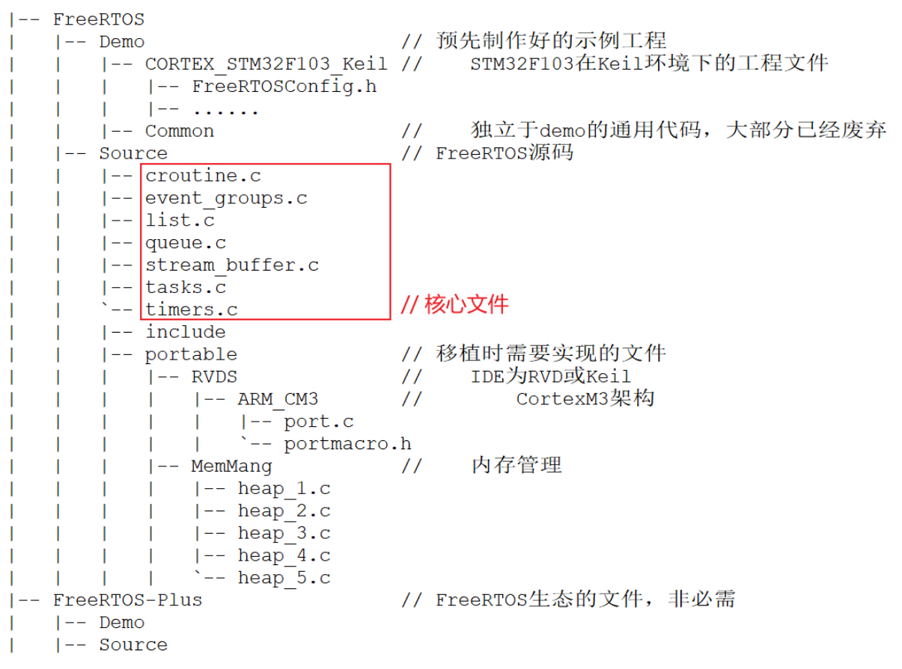
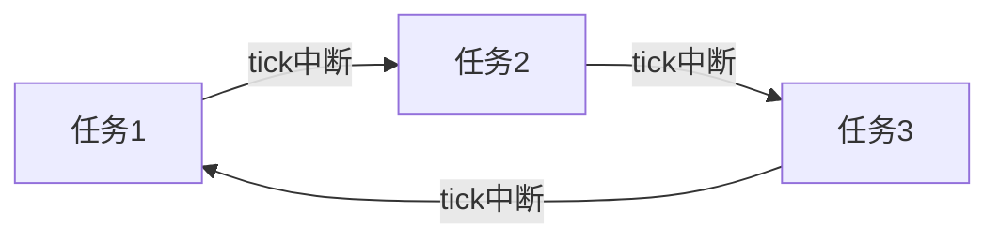
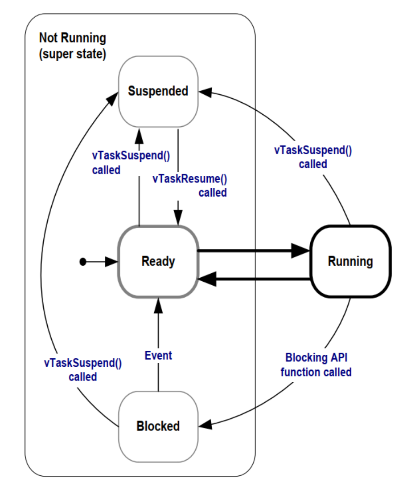
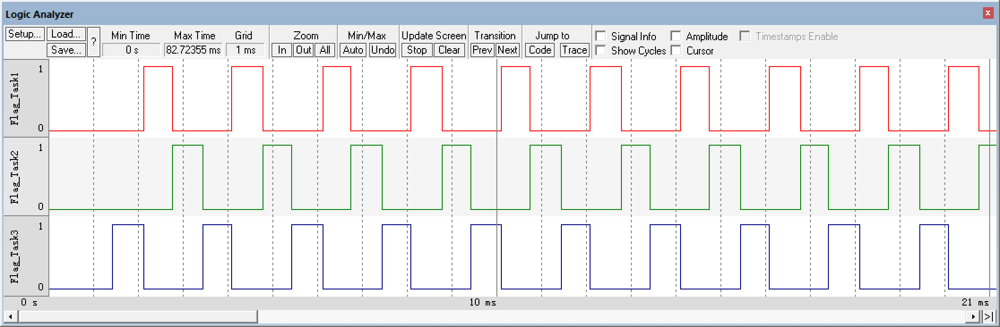
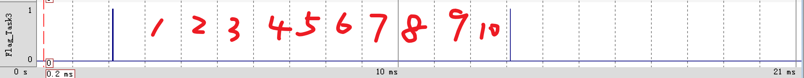
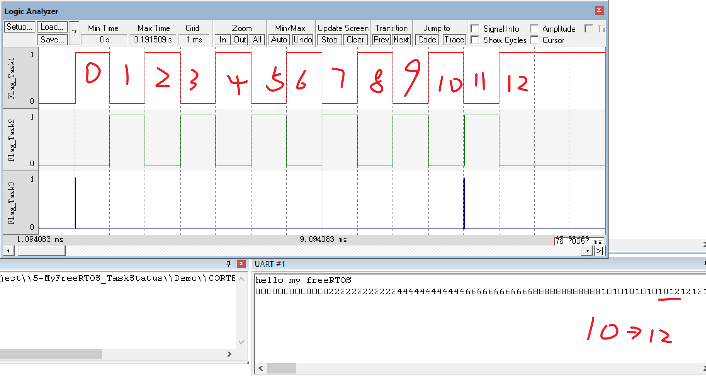
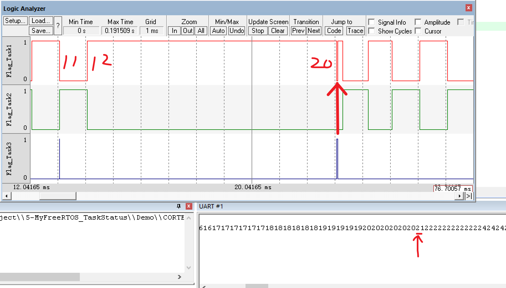

### 一. 堆和栈

##### 1. 堆(heap)

堆由开发人员手动申请分配和释放空间，若不手动释放，程序结束由系统释放，但在单片机都会有while(1)死循环，程序无法结束，因此要牢记申请空间用完后释放。

##### 2. 栈(stack)

栈由系统自动分配和释放内存，存放函数的返回地址，局部变量等

---

### 二.从目录文件了解源码结构

从[FreeRTOS](https://www.freertos.org/)官网下载的文件解压缩之后，得到三个目录文件

##### FreeRTOS

RTOS的核心，打开之后得到以下文件夹

+ Demo：官方Demo，打开之后
  + 各种处理器rtos的demo
  + 一个common通用文件夹

+ License：应该是开源凭证
+ Source：FreeRTOS的核心源代码
+ Test：一些测试

##### FreeRTOS-Plus

官方描述是FreeRTOS和一些组件的结合

[FreeRTOS-Plus](http://www.freertos.org/plus)

##### tools

暂时不懂，以后补充

---

整体目录结构图：



---

### 三.创建任务

##### 动态创建

###### 函数

```C
//动态创建任务函数
BaseType_t xTaskCreate( TaskFunction_t pxTaskCode,
                            const char * const pcName, 
                            const configSTACK_DEPTH_TYPE usStackDepth,
                            void * const pvParameters,
                            UBaseType_t uxPriority,
                            TaskHandle_t * const pxCreatedTask )
```

###### 参数解析

```C
TaskFunction_t pxTaskCode//任务执行的函数，直接写函数名字
const char * const pcName//任务的名字
const configSTACK_DEPTH_TYPE usStackDepth//栈的大小，深度
/*
	每个实时任务都是通过栈实现的，每个任务都有自己的栈
	这里的单位是字长(word)，等于4个字节
*/
void * const pvParameters//需要传入函数的参数
UBaseType_t uxPriority//任务优先级，数值越小优先级越低
TaskHandle_t * const pxCreatedTask//任务句柄
/*
	可以简单理解为一个媒介，通过这个媒介可以控制任务
	可以是NULL，也可以通过TaskHandle_t创建句柄并传入
	有句柄时其他任务就可以通过句柄控制对应的任务
*/
```
###### 举例

```C
//仅展示关键代码
void TaskFun1(void* arg)
{
	while(1)
	{
		printf("1");
	}
}

xTaskCreate(TaskFun1,"Task1",100,NULL,1,NULL);//无任务句柄

TaskHandle_t xTaskHandle1;
xTaskCreate(TaskFun1,"Task1",100,NULL,1,&xTaskHandle1);//传入任务句柄
```

---

##### 静态创建

###### 函数

```C
//静态创建任务函数
TaskHandle_t xTaskCreateStatic( TaskFunction_t pxTaskCode,
                                    const char * const pcName, 
                                    const uint32_t ulStackDepth,
                                    void * const pvParameters,
                                    UBaseType_t uxPriority,
                                    StackType_t * const puxStackBuffer,
                                    StaticTask_t * const pxTaskBuffer )
```

###### 参数解析

```C
TaskFunction_t pxTaskCode//任务执行的函数，直接写函数名字
const char * const pcName//任务的名字
const configSTACK_DEPTH_TYPE usStackDepth//栈的大小，深度
void * const pvParameters//需要传入函数的参数
UBaseType_t uxPriority//任务优先级，数值越小优先级越低
StackType_t * const puxStackBuffer//静态分配的空间
StaticTask_t * const pxTaskBuffer//静态任务句柄
```

###### 举例

如何静态创建任务

1. configSUPPORT_STATIC_ALLOCATION

​	该函数上下文

```C
#if ( configSUPPORT_STATIC_ALLOCATION == 1 )

    TaskHandle_t xTaskCreateStatic( TaskFunction_t pxTaskCode,
                                    const char * const pcName,
                                    const uint32_t ulStackDepth,
                                    void * const pvParameters,
                                    UBaseType_t uxPriority,
                                    StackType_t * const puxStackBuffer,
                                    StaticTask_t * const pxTaskBuffer )
    {
        ...
```

​	可以看出，如果需要静态创建任务，需要以下条件

> configSUPPORT_STATIC_ALLOCATION = 1

​	找到定义，在FreeRTOS.h里定义如下，默认为0，修改为1

```C
#ifndef configSUPPORT_STATIC_ALLOCATION
    /* Defaults to 0 for backward compatibility. */
    #define configSUPPORT_STATIC_ALLOCATION    1
#endif
```

2. 传入静态空间和静态任务句柄

```C
//全局变量
StackType_t xStackBuffer[100];//传入的空间
StaticTask_t xStaticTCB;//静态任务句柄
```

3. 使用函数

```C
xTaskCreateStatic(TaskFun2,"Task2",100,NULL,1,xStackBuffer,&xStaticTCB);
```

4. 额外函数的实现

在第三步进行编译之后，会报错某个函数未使用，这个函数跟静态创建任务有关

> vApplicationGetIdleTaskMemory

寻找定义，在vTaskStartScheduler函数里找到

```C
#if ( configSUPPORT_STATIC_ALLOCATION == 1 )
        {
            StaticTask_t * pxIdleTaskTCBBuffer = NULL;
            StackType_t * pxIdleTaskStackBuffer = NULL;
            uint32_t ulIdleTaskStackSize;

            /* The Idle task is created using user provided RAM - obtain the
             * address of the RAM then create the idle task. */
            vApplicationGetIdleTaskMemory( &pxIdleTaskTCBBuffer, &pxIdleTaskStackBuffer, &ulIdleTaskStackSize );
```

   为什么会用到vTaskStartScheduler函数呢？

就目前的个人理解：在创建任务之后，还需要启动任务才会运行，而vTaskStartScheduler就是启动多任务的开关。


回到上面，所以需要额外函数vApplicationGetIdleTaskMemory的实现

```C
StaticTask_t IdleTaskTCB[100];
StackType_t IdleTaskStack;

void vApplicationGetIdleTaskMemory( StaticTask_t ** ppxIdleTaskTCBBuffer,
                                        StackType_t ** ppxIdleTaskStackBuffer,
                                        uint32_t * pulIdleTaskStackSize )
{
	*ppxIdleTaskTCBBuffer = IdleTaskTCB;
	*ppxIdleTaskStackBuffer = &IdleTaskStack;
	*pulIdleTaskStackSize = 100;
	 
}

```

关于这一步，从函数名字知道这个是要获取空闲内存空间的，具体实现尚不清楚，还需进一步探索。

当这个函数实现之后即可完成静态创建任务的实现。

---

##### 关于任务的实验

###### 任务优先级

当创建以下任务时

```C
void TaskFun1(void* arg)
{
	while(1)
	{
		printf("1");
	}
}

void TaskFun2(void* arg)
{
	while(1)
	{
		printf("2");
	}
}
xTaskCreate(TaskFun1,"Task1",100,NULL,2,NULL);	xTaskCreate(TaskFun2,"Task2",100,NULL,1,&xTaskHandle2);
```

任务1的优先级为2，数值越大优先级越高。实验现象是，任务1一直在执行，如果任务1没有结束执行，则任务2就永远无法得到执行。

高优先级的任务先执行，同等优先级的任务交替执行。

---

###### 删除任务

函数

```C
void vTaskDelete( TaskHandle_t xTaskToDelete );
/*
最好在任务函数里调用，经测试，在main函数调用，无论是否传入句柄，无论是哪个句柄，都会删除第一个任务
参数为任务句柄，如果传入NULL，则自删
*/
```

```C
/*
	这里是在任务优先级的代码基础上进行修改，这个实验的任务优先级相等
	这个实验是在任务1执行一定时间后删除任务2
	任务2句柄为全局变量
*/
TaskHandle_t xTaskHandle2;
void TaskFun1(void* arg)
{
	u8 i=0;
	u8 flag_del=0;
	while(1)
	{
		i++;
		if( i>100 && flag_del==0 )
		{
			vTaskDelete(xTaskHandle2);
			flag_del=1;
			i=0;
		}
		printf("1");	
	}
}
```

---

###### 多个任务使用同一个函数

```C
void TaskCommonFun(void* arg)
{
	int num=(int)arg;
	while(1)
	{
		printf("%d",num);
	}	
}

//以下是在main函数里
xTaskCreate(TaskCommonFun,"Task1",100,(void*)6,1,NULL);
xTaskCreate(TaskCommonFun,"Task2",100,(void*)9,1,NULL);
```

---

### 四.任务管理

#### 1.任务状态

##### 原理

都说同优先级的任务交替执行，这个交替切换的基础是什么？

**tick中断**

一个任务运行的时间就是一个tick产生中断的时间

这个tick的时间可以修改,在FreeRTOSConfig.h里

```C
#define configTICK_RATE_HZ			( ( TickType_t ) 1000 )
```

假设有三个任务，交替切换原理大概如下



当任务1运行时处于running状态，在下个tick中断到来之前，其他任务处于ready状态，由此得知，每个任务都一个状态

**任务状态**

+ running：运行
+ ready：等待运行
+ blocked：阻塞，等待某件事到来才能运行，比如中断，其他任务执行结束
+ suspended：暂停，主动或被动



---

##### 实验

1. 预备

​	创建三个变量，通过keil逻辑分析仪来观察RTOS的任务状态

​	优先级相同的任务交替执行，观察结果如下



---

​	2. 体现四种任务状态的实验

​	概述

​	让任务1运行到10个tick时，让任务2暂停(suspended)，任务1运行到20个tick后恢复任务2(resume)；任务3每次阻塞10个tick(delay);

​	<span id="task_status_fun">三个任务函数如下：</span>

```C
//函数作用请看概述
void TaskFun1(void* arg)
{
	TickType_t t_start = xTaskGetTickCount();
	TickType_t t = 0;
	u32 temp=0;
	u8 t_flag=0;
	while(1)
	{
		t = xTaskGetTickCount();
		temp = t - t_start;
		printf("%ld",temp);
		Flag_Task1=1;
		Flag_Task2=0;
		Flag_Task3=0;
		if(t > t_start + 10 && t_flag!=1)
		{
			vTaskSuspend(xTaskHandle2);
			t_flag = 1;
		}
		if(t > t_start + 20)
		{
			vTaskResume(xTaskHandle2);
		}
	}
}

void TaskFun2(void* arg)
{
	while(1)
	{
//		printf("2");
		Flag_Task1=0;
		Flag_Task2=1;
		Flag_Task3=0;
	}
}

void TaskFun3(void* arg)
{
	while(1)
	{
//		printf("3");
		Flag_Task1=0;
		Flag_Task2=0;
		Flag_Task3=1;
		vTaskDelay(10);
	}
}
```

	3. 实验现象

先看任务3



虚线间隔为1tick，在程序里设置为1ms，在这里看起来像是11个tick，个人理解是任务3是delay10个tick，应该是delay完整的tick，在标号1tick之前，任务在执行，可能不算完整的tick

任务3体现了任务阻塞状态blocked

---

再看任务1形成的现象



这里还用到串口打印[任务1函数](#task_status_fun)里的temp = t - t_start，来获取当前tick与任务1刚执行时的时间差，这里展示的是理论上的前10个tick

**可以看到，一开始时间差为0，所以索引应该从0开始，直到序号12tick，任务2才被暂停(suspended)，这是因为同优先级的任务交替执行，任务3blocked，所以任务1和任务2在交替执行，因此任务1里的t之间相差2，又因为是相差2，所以才会在序号12tick时任务suspended，理应是在序号11tick**

再看任务2suspended状态下的现象



根据前面的分析，导致了任务2suspended持续时间不足10tick的现象

**这里任务1突然出现下降沿又上升是因为任务3的blocked结束，进入running，之后又blocked，任务函数实现的就是用变量展示哪个任务在running，其他的任务就ready。按前面的分析，理论来说，这里应该时间差到22，任务2才会resume，这个任务3的小插曲刚好让时间差为21，让任务2resume。虽然任务2resume，但仍有一小段为低电平，是因为让任务2resume之后，这个tick是任务1在running。**

这个实验很好的体现了任务的四种状态
